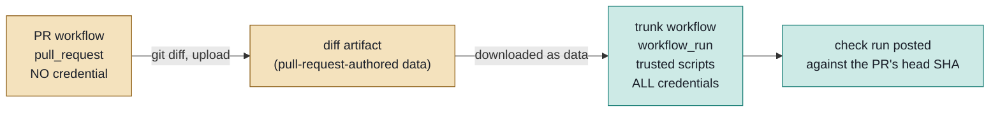

# Setting up a credential-safe AI review pipeline

An operator's guide to standing up an automated code-review pipeline in a
GitHub repository without exposing the credentials it runs on to the pull
requests it reviews.

It is written to stand on its own. It assumes no particular generator, CLI,
wizard, or scaffolding tool, and every step below can be carried out by hand
from a browser and a terminal. Where an implementation ships helper scripts,
they automate these steps; they do not replace them, and this document stays
correct whether or not they exist.

- [Who this is for](#who-this-is-for)
- [The problem being solved](#the-problem-being-solved)
- [The architecture in one picture](#the-architecture-in-one-picture)
- [What you will end up with](#what-you-will-end-up-with)
- [Step 1: choose the trusted branch](#step-1-choose-the-trusted-branch)
- [Step 2: create the GitHub App](#step-2-create-the-github-app)
- [Step 3: store the private key](#step-3-store-the-private-key)
- [Step 4: create the environment](#step-4-create-the-environment)
- [Step 5: the branch policy](#step-5-the-branch-policy)
- [Step 6: store the three secrets](#step-6-store-the-three-secrets)
- [Step 7: write the two workflows](#step-7-write-the-two-workflows)
- [Step 8: require the gate](#step-8-require-the-gate)
- [Verifying it actually works](#verifying-it-actually-works)
- [Rotating a credential](#rotating-a-credential)
- [Troubleshooting](#troubleshooting)

## Who this is for

Anyone running CI on a repository that accepts pull requests, where a job
needs a live credential: an API key for a review model, a token that posts
comments, or anything else with a cost or a blast radius.

You need admin on the repository, and the ability to create a GitHub App
under your account or organisation.

## The problem being solved

CI runs the code in a pull request on every push, before any human reviews or
merges it. If a live credential is in reach while that code executes, the
credential is exposed. There are two ways a pull request reaches one:

- **Adding a job.** Repository secrets are not scoped to any particular
  workflow, so a pull request can add its own job that names a secret
  directly. Nothing existing has to be touched.
- **Editing a script.** Any script CI already runs while holding a credential
  can be rewritten by the pull request that CI is about to run.

Log masking does not help. It redacts a secret's exact string in the run log,
so encoding the value before printing it, or sending it straight out over the
network without ever logging it, both defeat it completely. Treat any
credential that reaches pull-request-controlled code as fully stolen.

The two problems need two different fixes, and you need both:

- **A pull request adds a job naming the secret.**
  - Fix: move the secrets onto an **environment** with a deployment branch
    policy.
  - Why it holds: GitHub checks the running branch against that policy,
    server side, before releasing any value.
- **A pull request edits a script CI already runs.**
  - Fix: split the pipeline across two **triggers**.
  - Why it holds: a `workflow_run` workflow always resolves its own YAML,
    and everything it checks out, from the default branch.

## The architecture in one picture



The single behaviour everything rests on: a `pull_request`-triggered workflow
reads its own YAML, and every script it calls, from the **pull request's
branch**, while a `workflow_run`-triggered workflow always reads them from the
repository's **default branch**. A pull request may freely rewrite the trunk
workflow or any script it runs; the edit sits inert until a human merges it,
and only the next run after that merge executes it.

So the pull request's content still reaches the reviewer, but only as inert
data it reads, never as code it runs.

## What you will end up with

- One GitHub App, installed on the repository, with a single permission.
- One environment holding three secrets, released only to named branches.
- Two workflow files.
- One required status check that the pull request side cannot influence.

## Step 1: choose the trusted branch

Pick the branch whose contents you are willing to treat as trusted. It has to
be the repository's **default branch**, because that is the branch a
`workflow_run` workflow resolves from; there is no setting that points it
elsewhere.

Whatever branch that is, it needs:

- **Branch protection**, requiring pull request review before anything lands.
- **A code-owner requirement** on the review scripts and the workflow files,
  so a change to what the trusted side executes cannot be approved by its own
  author.

Note what code ownership does and does not do here. It gates the **merge** of
a malicious edit; it does not gate its **execution**, because both attacks
above run on push, long before any merge. It is worth having anyway: the
trusted side's safety depends on its scripts being reviewed before they
become the default-branch version, and that is exactly what it enforces.

You do not have to use `main`. Any branch can be the default, and a project
that wants to keep `main` untouched can point the default at a dedicated
branch that carries only the security-relevant files.

## Step 2: create the GitHub App

The pipeline posts its findings as an App rather than as the built-in Actions
token for two reasons: an App token can be scoped to one permission, and
comments it posts are attributable to a distinct identity rather than to
generic automation.

Create it under your account (`Settings -> Developer settings -> GitHub Apps
-> New GitHub App`) or under an organisation (`Settings -> Developer settings
-> GitHub Apps -> New GitHub App`), and set:

| Field | Value |
| --- | --- |
| Name | anything unique across GitHub |
| Homepage URL | your repository's URL |
| Webhook | **uncheck Active**; this App receives no events |
| Repository permissions | **Pull requests: Read and write**, nothing else |
| Where can this be installed | Only on this account |

`Pull requests: write` is the whole list on purpose. That permission is what
posting a review comment, resolving or reopening a thread, and editing a
status comment need. Because the App's token is handed to a job that also
handles review output, its scope **is** the blast radius should it ever leak:
at this scope, the worst case is tampering with this repository's pull
request conversations, not with the repository.

Then **install** it on the repository. Creating an App does not install it,
and an App that is not installed can mint no token. Note the **App ID** shown
on the App's settings page; it is a public value.

> Automating this step: GitHub has no API that creates an App. The closest
> mechanism is the App *manifest flow*, where a program submits a manifest
> describing the App, a human confirms it in the browser, and GitHub returns a
> short-lived code that the program exchanges via
> `POST /app-manifests/{code}/conversions` for the App's id and private key.
> The human confirmation is intentional in that design and cannot be removed.

## Step 3: store the private key

On the App's settings page, generate a private key. GitHub downloads a `.pem`
file and keeps no copy of it.

Handle it as follows:

- Never commit it, and never paste it into a terminal, a chat, or a ticket.
- Store it only as the secret in Step 6, and delete the local file afterwards.
- If it is ever exposed, delete that key on the App's settings page and
  generate a new one. Deleting a key immediately invalidates every token
  minted from it.

## Step 4: create the environment

Repository secrets are available to any job in the repository, which is
exactly the property that has to go away. An environment is the only place
GitHub lets a secret be scoped more narrowly.

In `Settings -> Environments`, create an environment. Name it for what it is,
for example `ai-review`. Leave required reviewers and wait timers off unless
you want a human approval on every review run.

The equivalent API call, if you prefer a terminal:

```bash
gh api -X PUT "repos/OWNER/REPO/environments/ai-review" \
  --input - <<'JSON'
{"deployment_branch_policy":
  {"protected_branches": false, "custom_branch_policies": true}}
JSON
```

## Step 5: the branch policy

This is the step that closes the "add a new job" attack, and it is the one
most easily got wrong.

On the environment, select **Deployment branches and tags -> Selected
branches and tags**, and add the trusted branch from Step 1 by its **exact
name**. Add nothing else, and do not use a wildcard that a contributor could
match by naming their branch to fit it.

```bash
gh api -X POST \
  "repos/OWNER/REPO/environments/ai-review/deployment-branch-policies" \
  -f name=main -f type=branch
```

What this buys you: when a job declares `environment: ai-review`, GitHub
compares the ref that job is running on against this list **before** it
releases any of the environment's secrets. That comparison happens server
side, and is independent of the workflow's YAML, of what triggered the job,
and of who owns which file. A job on a pull request branch is never on the
list, so it receives nothing, no matter what code it contains. It still runs;
it simply gets empty values.

Two notes:

- A policy entry is a **name matched at request time**, not a reference
  resolved now, so you can add a branch that does not exist yet.
- Prefer "selected branches" over "protected branches". The latter allows
  *any* protected branch, which silently widens the allow-list every time
  somebody protects a new one.

## Step 6: store the three secrets

Set all three **on the environment**, not on the repository:

- `AI_REVIEW_ENGINE_TOKEN_<ENGINE>`: the review model's API credential.
  Paste it at a prompt; only a human ever has the plaintext.
- `AI_REVIEW_APP_ID`: the App's id from Step 2. A public value, safe to type
  on a command line.
- `AI_REVIEW_APP_KEY`: the `.pem` from Step 3. Pipe the file in; never paste
  its contents anywhere.

```bash
gh secret set AI_REVIEW_APP_ID    --env ai-review --body 123456
gh secret set AI_REVIEW_APP_KEY   --env ai-review < path/to/app.pem
gh secret set AI_REVIEW_ENGINE_TOKEN_CLAUDE --env ai-review   # prompts
```

On the engine token's name: the format is
`AI_REVIEW_ENGINE_TOKEN_<ENGINE>`, one secret per review engine, and more
than one can be held at once. The `<ENGINE>` suffix is a variable, not part
of the name. The trunk workflow maps whichever one it selects into a single
engine-agnostic variable that the review script reads, so adding or switching
providers is a one-line change in the workflow, never a secret rename.

If any of these three already exist as **repository** secrets from an earlier
setup, leave them in place until the split is proven working, then delete
them. A repository secret with the same name is exactly what the environment
scoping exists to remove, so the move is not finished while they are there.

## Step 7: write the two workflows

### The pull request workflow

Triggered by `pull_request`. It runs the pull request's own code, so it must
be worth nothing to an attacker:

- It names **no secret**.
- Its only permission is `contents: read`, for the checkout.
- It does one thing: extract the diff under review with `git diff` and upload
  it as an artifact.

```yaml
name: ai-review
on:
  pull_request:
    types: [opened, synchronize, reopened]
permissions: {}
jobs:
  extract-diff:
    runs-on: ubuntu-latest
    permissions:
      contents: read
    steps:
      - uses: actions/checkout@<pinned-sha>
        with: { fetch-depth: 0 }
      - env:
          BASE_REF: origin/${{ github.event.pull_request.base.ref }}
        run: |
          mkdir -p ai-review-input
          git diff "$BASE_REF"...HEAD >ai-review-input/diff.txt
      - uses: actions/upload-artifact@<pinned-sha>
        with:
          name: ai-review-diff
          path: ai-review-input/
          if-no-files-found: error
```

### The trunk workflow

Triggered by `workflow_run` on the first workflow's completion. This one
holds everything:

```yaml
name: ai-review-trunk
on:
  workflow_run:
    workflows: [ai-review]
    types: [completed]
permissions: {}
jobs:
  review:
    if: ${{ github.event.workflow_run.event == 'pull_request' }}
    runs-on: ubuntu-latest
    environment: ai-review          # <- releases the secrets, branch-checked
    permissions:
      contents: read
      pull-requests: read
      actions: read                 # <- to read another run's artifact
    steps:
      - uses: actions/checkout@<pinned-sha>   # <- NO ref:. See below.
      - uses: actions/download-artifact@<pinned-sha>
        with:
          name: ai-review-diff
          run-id: ${{ github.event.workflow_run.id }}
          github-token: ${{ github.token }}
      - env:
          AI_REVIEW_ENGINE_TOKEN: ${{ secrets.AI_REVIEW_ENGINE_TOKEN_CLAUDE }}
        run: ./review.sh
```

Four rules for this file. Every one of them is a way to silently lose the
guarantee:

1. **No `ref:` on any checkout.** For a `workflow_run` event,
   `actions/checkout` defaults to the default branch, which is the entire
   point. Adding `ref: ${{ github.event.workflow_run.head_sha }}` looks
   helpful ("check out the commit that triggered this") and checks out the
   pull request's code instead, with every credential present. No error, no
   warning, guarantee gone.
2. **The artifact is data.** Read it, pass it to a model, parse it as text.
   Never source it, execute it, or evaluate it.
3. **Trust GitHub's payload, not the artifact, for identity.** The head SHA
   and the pull request number must come from
   `github.event.workflow_run.head_sha` and
   `github.event.workflow_run.pull_requests[0].number`. Taking either from
   the artifact would let one pull request post its review, under your App's
   identity, onto somebody else's.
4. **Keep the token-minting job separate from the content-processing job.**
   Within one job, an earlier step can influence the environment (`GITHUB_ENV`,
   `GITHUB_PATH`, `NODE_OPTIONS`) that a later step in that same job runs
   under. Separate jobs are separate runners, so nothing carries across.

For point 3, note that `pull_requests[0]` is **empty for a pull request
opened from a fork**. If you accept fork contributions, resolve the number
from `GET /repos/{owner}/{repo}/commits/{sha}/pulls` instead of proceeding
with an empty value.

## Step 8: require the gate

A `workflow_run`-triggered job does **not** appear as a status on the pull
request that triggered it, the way a `pull_request`-triggered job does. If
your merge gate lives in the trunk workflow, and you make it a required
check, every pull request will block forever on a check that never reports.

Post the verdict explicitly as a check run, anchored to the pull request's
head commit:

```bash
gh api -X POST "repos/OWNER/REPO/check-runs" --input - <<JSON
{"name": "ai-review-resolved",
 "head_sha": "$HEAD_SHA",
 "status": "completed",
 "conclusion": "success",
 "output": {"title": "...", "summary": "..."}}
JSON
```

Three details decide whether branch protection accepts it:

- **The name must match the required context exactly**, byte for byte.
- **Create it with the built-in Actions token**, not the App's. Branch
  protection records each required context alongside the app that most
  recently reported it. A check run created with the App's token is
  attributed to the App, so protection keeps waiting for one from Actions
  that never arrives. The job needs `checks: write` for this.
- **Publish it on failure too.** If the job aborts before reaching this step,
  no check run exists and the pull request is blocked with nothing to read.
  Evaluate the gate, publish the verdict either way, then fail the job.

Finally, add the check's name to the branch's required status checks.

## Verifying it actually works

Configuration that looks right and is not is the normal outcome here, so test
all three properties on real pull requests. Read the results from the run
logs and the pull request, never from the YAML.

- **A new job cannot get a secret.** Open a pull request adding a
  `pull_request`-triggered workflow that names one of the environment's
  secrets and prints its length. Confirm the length is zero.
- **An edited script does not run.** Open a pull request that edits one of
  the credentialed review scripts to something obviously different, for
  instance changing a message it prints. Confirm the run still shows the
  default branch's behaviour, and repeat it for each credentialed script.
- **Ordinary review still works.** Push a normal pull request and confirm the
  findings post, the gate blocks while something is unresolved, clears when
  it is resolved, and the check run reports against the head SHA.

## Rotating a credential

- **The engine token.** Issue a new one with the provider, set the secret
  again, then revoke the old one. It is a static credential with no expiry,
  so a leaked one stays useful until it is revoked.
- **The App private key.** Generate a new key on the App's settings page,
  update `AI_REVIEW_APP_KEY`, then delete the old key there. Deletion is
  immediate.
- **The App's own tokens.** These are minted per run and expire on their own
  in about an hour; there is nothing to rotate.

## Troubleshooting

- **The trunk workflow never runs.** Its file is not on the default branch
  yet. `workflow_run` only fires for a listener that already exists there,
  which is why the pull request that introduces the trunk workflow cannot
  exercise it.
- **The required check sits on "Expected" forever.** No check run is being
  created, or its name does not match the required context exactly.
- **The check is green but branch protection still blocks.** The check run
  was created by the wrong app. Create it with the Actions token.
- **Secrets are empty in the trunk workflow.** The job is missing
  `environment:`, or the branch it runs on is not on the deployment branch
  policy.
- **Secrets are still readable from a pull request.** A repository-level copy
  of the same secret still exists. Delete it.
- **The artifact download fails.** The pull request workflow uploaded a
  different name, or failed before uploading. Fail the gate closed here
  rather than reviewing nothing.
